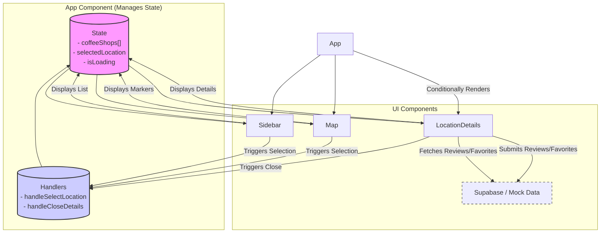

# Coffee Lover - Taichung Coffee Shop Finder

Coffee Lover is an interactive web application designed for discovering, exploring, and reviewing coffee shops in Taichung, Taiwan. Built with modern web technologies, it provides a seamless user experience for finding the perfect cafe.

The application leverages React, TypeScript, and Vite for a fast and type-safe frontend development experience, styled with Tailwind CSS. It integrates with the Google Maps API for interactive mapping and Supabase for backend services (currently utilizing mock data for demonstration and development purposes).

## Features

*   **Interactive Map:** Visualize coffee shop locations across Taichung using Google Maps, with marker clustering for performance.
*   **Dynamic Sidebar:** Browse a list of coffee shops, dynamically updated from the data source.
*   **Detailed Location View:** Click on a shop in the sidebar or a map marker to view comprehensive details in a modal window, including:
    *   Address, Description, Menu Highlights
    *   Amenities (Opening Hours, Price Range, Wi-Fi, Pet-Friendly - *data pending*)
*   **User Reviews:** View existing reviews and submit new ones for each coffee shop. (Currently uses mock data, Supabase integration planned).
*   **Favorites System:** Mark coffee shops as favorites for easy tracking. (Currently uses mock data, Supabase integration planned).
*   **Sharing:** Easily share coffee shop details via the Web Share API or by copying a link to the clipboard.
*   **Loading States:** Provides visual feedback while data (maps, shop details, reviews) is being loaded.
*   **Responsive Design:** Adapts to different screen sizes (basic structure).

## Component Architecture

The application follows a component-based architecture managed primarily by the main `App` component.

*   **App:** The root component holding the main application state (`coffeeShops`, `selectedLocation`, `isLoading`) and handlers.
*   **Sidebar:** Displays the list of `coffeeShops` and triggers `handleSelectLocation` on click.
*   **Map:** Displays `coffeeShops` as markers on Google Maps and triggers `handleSelectLocation` on marker click.
*   **LocationDetails:** Conditionally rendered modal displaying details of the `selectedLocation`. It fetches/submits reviews and favorites (attempting Supabase, falling back to mock data) and handles closing itself.

## Key Technologies

*   **Frontend Framework:** React
*   **Language:** TypeScript
*   **Build Tool:** Vite
*   **Styling:** Tailwind CSS
*   **Mapping:** React Google Maps API (`@react-google-maps/api`)
*   **Backend/Database:** Supabase (`@supabase/supabase-js`)
*   **UI Icons:** Lucide React
*   **Notifications:** React Hot Toast
*   **Schema Validation:** Zod (Used in `types.ts`)
*   **Testing:** Vitest, React Testing Library (Setup present, tests need implementation)

---
