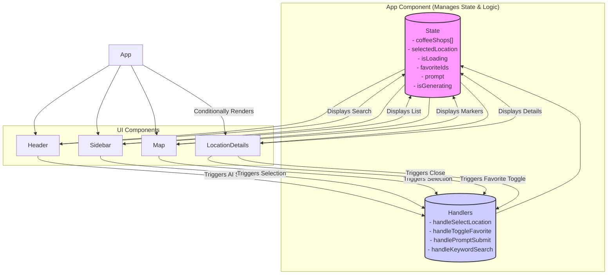

# Coffee Lover - Coffee Shop Finder

Coffee Lover is an interactive web application designed for discovering, exploring, and reviewing coffee shops. Built with modern web technologies, it provides a seamless user experience for finding the perfect cafe.

## Live Demo

**Check out the live website:** [**coffeelover.fun**](https://coffeelover.fun)

---

The application leverages React, TypeScript, and Vite for a fast and type-safe frontend development experience, styled with Tailwind CSS. It integrates with the Google Maps API for interactive mapping and uses the Google Places API for shop data. Favorites are stored locally, and an AI assistant (powered by Google Gemini) helps with natural language searches across multiple regions.

## Features

*   **Interactive Map:** Visualize coffee shop locations across Taichung using Google Maps, with marker clustering for performance.
*   **Dynamic Sidebar:** Browse a list of coffee shops, dynamically updated from the data source.
*   **Detailed Location View:** Click on a shop in the sidebar or a map marker to view comprehensive details in a modal window, including:
    *   Address, Description, Menu Highlights
    *   Amenities (Opening Hours, Price Range, Wi-Fi, Pet-Friendly - *data pending*)
*   **User Reviews:** View existing reviews and submit new ones for each coffee shop. (Currently uses mock data, Supabase integration planned).
*   **Natural Language Search:** Use the "Ask Coffeelover" search bar in the header. The AI extracts keywords, location, count, and filters (open hours, amenities, distance, minimum rating) from your query (e.g., "quiet cafes open late", "5 coffee shops near me with wifi over 4.5 stars", "cafes within 2km").
    *   **Distance Search:** Specify a radius (e.g., "10km", "5 miles"). The backend proxy uses this for the initial search bias, and the frontend applies a strict distance filter to the results.
    *   **Rating Filter:** Specify a minimum rating (e.g., "over 4 stars", "at least 4.5"). The frontend filters results to match.
*   **Favorites System:** Mark coffee shops as favorites (red emoji pins) directly without login. Favorites are saved locally in your browser using `localStorage`.
*   **Sharing:** Easily share coffee shop details via the Web Share API or by copying a link to the clipboard.
*   **Enhanced Map Markers:** Markers are now larger coffee emojis (☕️), turning red for favorites and showing a "no entry" sign (🚫) for shops known to be closed (requires opening hours data).
*   **Loading States:** Provides visual feedback while data (maps, shop details) is being loaded.
*   **Responsive Design:** Adapts to different screen sizes (basic structure).

## Component Architecture

The application follows a component-based architecture managed primarily by the main `App` component, which holds the core state and logic.

*   **App:** The root component holding the main application state (`coffeeShops`, `selectedLocation`, `isLoading`, `favoriteIds`, AI prompt state) and handlers (selection, favorites, AI search, keyword search).
*   **Header:** Contains the "Ask Coffeelover" search bar, taking prompt input and triggering the AI search handler in `App`.
*   **Sidebar:** Displays the list of `coffeeShops` (updated by search results) and triggers `handleSelectLocation` on click. Title changed to "Nearby Coffee Shops".
*   **Map:** Displays `coffeeShops` as markers on Google Maps, updates pin colors based on `favoriteIds`, and triggers `handleSelectLocation` on marker click.
*   **LocationDetails:** Conditionally rendered modal displaying details of the `selectedLocation`. Handles toggling favorites (which updates state in `App`) and closing itself.

## Key Technologies

*   **Frontend Framework:** React
*   **Language:** TypeScript
*   **Build Tool:** Vite
*   **Styling:** Tailwind CSS
*   **Mapping:** React Google Maps API (`@react-google-maps/api`)
*   **Backend/Database:** Google Places API (via Vite proxy), `localStorage` (for favorites)
*   **AI:** Google Generative AI (`@google/generative-ai`)
*   **UI Icons:** Lucide React
*   **Notifications:** React Hot Toast
*   **Database:** Supabase (for schema migrations - `locations`, `reviews`, `favorites` tables; includes `has_wifi`, `has_chargers`, `charger_count` in `locations`)
*   **Testing:** Vitest, React Testing Library (Setup present, tests need implementation)

---
