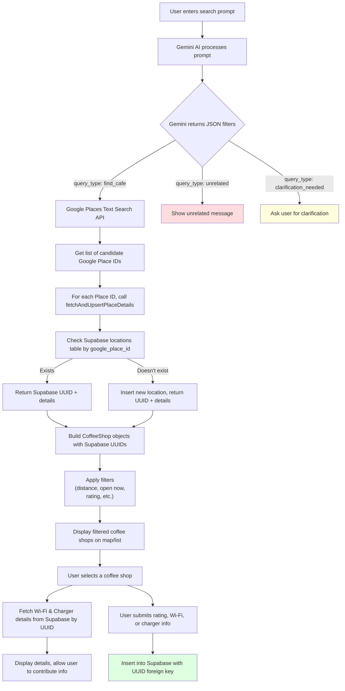

# CoffeeLover App

A React + TypeScript + Supabase app for discovering and contributing info about coffee shops.

## Features

- Natural language search powered by Gemini AI (understands city names, filters, etc.)
- Filters for Wi-Fi, power outlets, price, vibe, open hours, etc.
- Google Places API integration for shop details, photos, and search
- Displays up to 3 photos per shop in an image carousel
- Shows accurate price level (e.g., $, $$, $$$)
- Supabase backend with RLS policies
- User-contributed Wi-Fi passwords, charger info, and ratings
- OAuth login with Google and GitHub
- Netlify deployment with serverless function proxy for Google API

## Architecture Overview

## Setup Notes

- Supabase `locations` table uses UUID primary key and stores `google_place_id` (text, unique).
- Related tables (`location_ratings`, `location_wifi_details`, `location_charger_details`) use UUID foreign keys referencing `locations.id`.
- OAuth providers (Google, GitHub) configured with correct redirect URIs.
- RLS policies allow authenticated users to insert and select their own data.

## TODO

- Fix any remaining bugs in search and submission flows.
- Improve UI/UX for contribution forms.
- Add more fallback logic and error handling.
- Polish and deploy.
